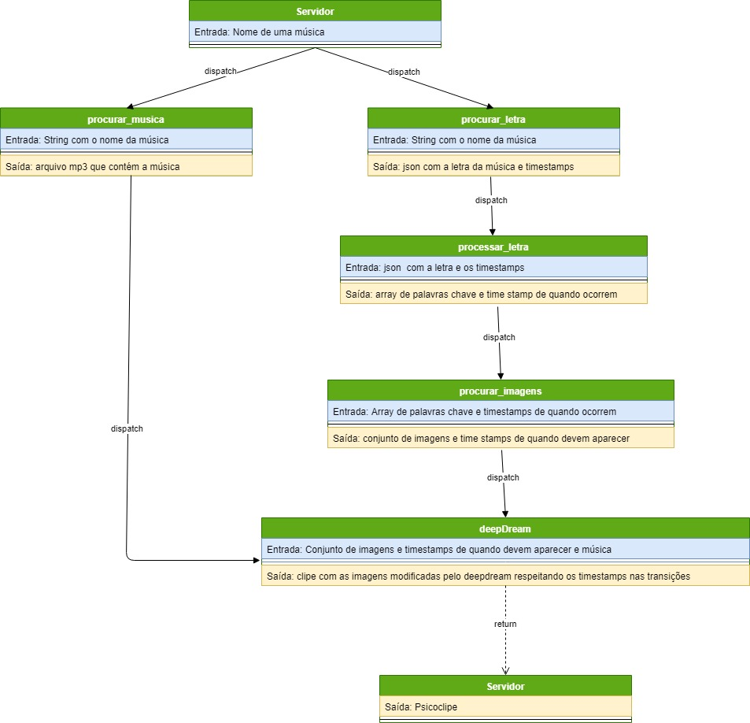

# psiclipe
Projeto inicialmente desenvolvido na Disciplina de Introdução a Multimídia

## Fluxo


## Pasta raiz do projeto dentro do container: 
```/code```
O volume é mapeado automaticamente para o diretorio onde se encontra o docker-compose. Uma alteração no arquivo local implica uma alteração nos arquivos mapeados dentro do container.

## Requisitos
* docker e docker-compose instalados.
* No caso de windows, é necessário instalar o Docker for Windows, e abilitar o Hyper-V (apenas windows education, pro, enterprise)
nas configurações do Docker for Windows também deve-se adicionar o disco rígido aos "shared paths" do Docker for Windows.

## Alguns comandos para manipular o Container

Comando para buildar o container:
no diretório do docker-compose.yml, digitar:
```docker-compose up -d```
Esperar a imagem ser buildada. A primeira vez demora um pouco pois deve-se baixar todos os arquivos e atualizações necessários.

para "entrar" dentro do container:
```docker exec -it psiclipe bash```

para reiniciar o container: 
```docker restart psiclipe```

## Ferramentas pré instaladas no container:

### Deep Dream
https://github.com/herval/deepdream-docker (rede neural)  
### Flask
http://flask.pocoo.org/ (webserver python)  porta padrão: localhost:5000
### BeautifulSoup
https://www.crummy.com/software/BeautifulSoup/ (analise de texto html)
### youtube-dl
https://ytdl-org.github.io/youtube-dl/index.html  (coleta musicas do youtube)  
### google_images_download
https://github.com/hardikvasa/google-images-download (coleta de imagens)
### Rake-nltk
https://github.com/csurfer/rake-nltk (processamento de texto)
### Moviepy
https://zulko.github.io/moviepy/ (criação de vídeo)
